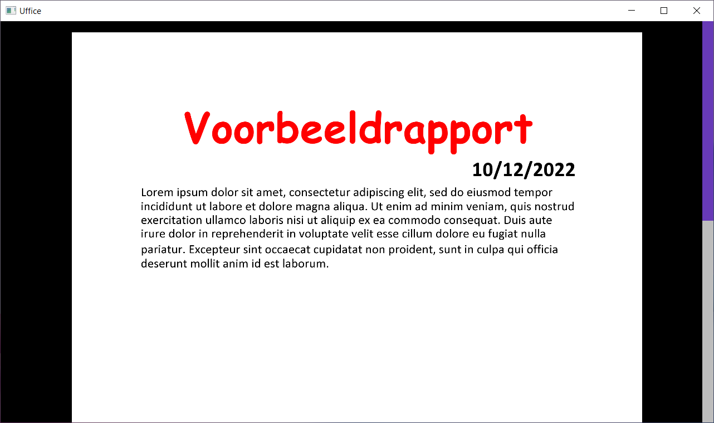

# Uffice
[](https://github.com/usadson/uffice/actions/workflows/build.yaml)

Uffice isuffice an alpha-stage word processor, working on compatibility with WordprocessingML format of the [Office Open Specification (ECMA-376)](https://www.ecma-international.org/publications-and-standards/standards/ecma-376/).

<p align="center">
   
</p>

## Installation
As the software is alpha-stage, the user experience is yet to be. You can simply clone this repository and use [Cargo](https://doc.rust-lang.org/cargo/) to build the project.

```sh
# Clone using HTTP:
git clone https://github.com/usadson/uffice

# or using SSH:
git clone git@github.com:usadson/uffice.git

cd uffice

# Build the application
cargo build
```

You might also need to include the SFML binaries and related files in the `target/debug` directory. For Windows, you can [read more here](https://github.com/jeremyletang/rust-sfml/wiki/Windows#for-msvc-toolchains). In the future, build scripts or related systems might have to be put in place to improve the UX, see for example this [StackOverflow post](https://stackoverflow.com/questions/31630064/rust-sfml-linking-with-cc-failed-how-to-specify-lib-include-share-path).

The following steps can be used on Windows:
1. Go to the [SFML download page](https://www.sfml-dev.org/download.php).
2. Download the latest release (at the moment this is [SFML 2.5.1](https://www.sfml-dev.org/files/SFML-2.5.1-windows-vc15-64-bit.zip)).
3. Extract the ZIP archive containing the prebuilt binaries into a proper directory.
4. Set the appropriate environment flags:
   1. `SFML_INCLUDE_DIR`: this should point to the `include` directory in the extracted directory.
   2. `SFML_LIBS_DIR`: this should point to the `lib` directory in the extracted directory.
5. You can create a [`.cargo/config.toml`](https://doc.rust-lang.org/cargo/reference/config.html) file to simplify this, for example:
```ini
[env]
SFML_INCLUDE_DIR = "C:/Users/user/Programs/SFML-2.5.1/include"
SFML_LIBS_DIR = "C:/Users/user/Programs/SFML-2.5.1/lib"
```
6. This step allows the application to be built:
```sh
cargo build
```
7. At the moment, `cargo run` doesn't work yet, because the DLLs can't be found. To solve this, put the SFML dlls in the `target/debug` directory. These can be found in the `dir` directory in the directory with the extracted SFML files.
8. Now the application can be started with `cargo run`!

## Usage
After having built the binary, running the binary yields no useful results. The environment variable `UFFICE_TEST_FILE` can be used to specify a file to be loaded when the application boots up.

Example:
```sh
# Load the Document.docx file
export UFFICE_TEST_FILE=/home/user/Document.docx

# Run the application
cargo run
```

## UX Checklist
The following checklist documents the requirements that have to put in place to help aid new users, installations and usages of the application.

- [x] Add a CI/CD pipeline
- [ ] Provide production-ready binaries
- [ ] Publish a release
- [ ] Add a build script to auto-install the SFML binaries
- [ ] Add a user interface to open files
- [ ] Add a greeting screen, welcoming the user to open a document
- [ ] Remove the `UFFICE_TEST_FILE` environment variable

## Reference Material
- [ECMA-376](https://www.ecma-international.org/publications-and-standards/standards/ecma-376/)

## Licensing
This project is currently licensed under a BSD-2-Clause-compatible [license](LICENSE.md), but uses various dependencies, with distinct licenses each.
